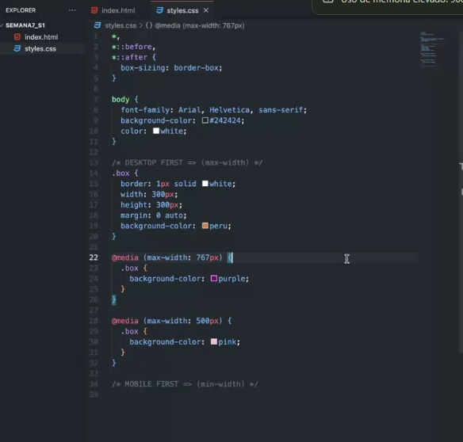

# Responsive web design 
Es un marco en el cual definimos reglas para hacer un diseño responsive, esto quiere decir que se adapte a cualquier resolución de pantalla sin que se distorcione el diseño.

## Reglas
1. Al momento de crear un media query se utiliza el @media y luego () en el cual va min-width o max-width, esto dependerá del tipo del tipo que se utilice, si es first modbile se utilizará min-width y si es first desktop max-width.
2. dentro de ese media query podemos añadir los estilos que necesitemos.



## Ejemplos

Tengo este código html
```html
<!DOCTYPE html>
<html lang="en">
<head>
    <meta charset="UTF-8">
    <!-- En responsive web design este meta ayuda para poder manejar las resoluciones
    las cuales pueden variar entre  1366 767 500 y 320 -->
    <meta name="viewport" content="width=device-width, initial-scale=1.0">
    <link rel="stylesheet" href="style.css">
    <title>Document</title>
</head>
<body>
    <header class="header">
        <nav class="Navigator_container">
            <ul class="Navigator_list">
                <li><a href="#" class="Navigator_item">Resumen</a></li>
                <li><a href="#" class="Navigator_item">Experiencia</a></li>
                <li><a href="#" class="Navigator_item">Proyectos</a></li>
                <li><a href="#" class="Navigator_item">Contactar</a></li>
            </ul>
        </nav>
    </header>
</body>
</html>
```

1. Utilizando first desktop 

    estos serían los styles
```css
*,*::before, *::after {
    box-sizing: border-box;
}

body {
    font-family: Arial, Helvetica, sans-serif;
    background-color: #242424;
    color: white;
    min-width:  320px;
}

.header {
    background-color: peru;
    padding: 10px;
    border-radius: 10px;    
}

.Navigator_list {
    list-style: none;
    display: flex;
    gap: 30px;
    flex-wrap: wrap;
    justify-content: space-evenly;
    align-items: center;
    padding: 0;
}

.Navigator_item {
    text-decoration: none;
    color: white;
    font-size: 30px;
}

```

y estos serían los querys 

```css

@media (max-width: 767px) {
    .Navigator_item {
        font-size: 18px;
        flex: 1;
    }
    .Navigator_list {
        gap: 18px;
    }
}

@media (max-width: 500px) {
    .header {
        background-color: palegreen;
    }

    .Navigator_list {
        display: flex;
        flex-direction: column;
        gap: 25px;
        justify-content: space-evenly;
        align-items: flex-start;
        list-style-type: disc;
        margin-left: 20px; 
    }
    .Navigator_item {
        font-size: 25px;
    }
}
```

2. Utilizando first mobile 

    estos serían los styles
```css
*,*::before, *::after {
    box-sizing: border-box;
}

body {
    font-family: Arial, Helvetica, sans-serif;
    background-color: #242424;
    color: white;
    min-width:  320px;
}


.header {
    background-color: palegreen;
    padding: 10px;
    border-radius: 10px;    
}

.Navigator_list {
    display: flex;
    flex-direction: column;
    gap: 25px;
    justify-content: space-evenly;
    align-items: flex-start;
    list-style-type: disc;
    margin-left: 20px; 
}
.Navigator_item {
    font-size: 25px;
    text-decoration: none;
}

```

y estos serían los querys 

```css

@media (min-width: 767px) {
    .header {
        background-color: peru;
    }
    .Navigator_list {
        list-style: none;
        flex-direction: row;
        gap: 18px;
        flex-wrap: wrap;
        justify-content: space-evenly;
        align-items: center;
        padding: 0;
    }
    .Navigator_item {
        color: white;
        font-size: 18px; 
    }
}

@media (min-width: 1200px) {
    .Navigator_item {
        font-size: 30px;
    }
    .Navigator_list {
        gap: 30px;
    }
}
```